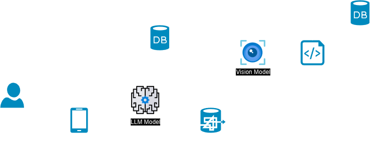

# Alvin

Alvin (Assistente de Localização e Vigilância sobre Incidentes Naturais ~óbivo que o nome não foi escolhido antes do significado~) é um chatbot caracterizado como um adorável cachorro caramelo disponibilizado no Telegram cuja função é auxiliar pessoas procurando ajuda e pessoas procurando ajudar em cenários de desastres naturais e emergências climáticas, como a histórica enchente do Rio Grande do Sul de 2024.

O Alvin é equipado com conversação baseada em Large Language Models e é capaz de acessar informações como abrigos que estão recebendos doações e/ou pessoas, encontrar pontos de recolhimento de recursos e abrigos próximos ao usuário, alertas da Defesa Civil, entre outros.

## Motivação
Esse projeto foi durante o hackathon [Maratona Pelo RS](https://github.com/TechPeloRS/maratona-pelo-rs), como parte do desafio de Assistência Humanitária.

O Telegram (assim como o WhatsApp) são aplicações largamente utilizadas e que muitos usuários já têm instalado em seus dispositivos móveis. Assim, a criação de um chatbot foi escolhida a fim de facilitar o acesso a informações verídicas pela população, através de um formato familiar e amplamente conhecido. De modo que se possa rapidamente obter direcionamentos sobre abrigos, doações e alertas em tempo real, à medida em que os dados ficam disponíveis.

A possibilidade de conversar com um assistente virtual torna a iteração mais simples, acessível e pessoal, o que é fundamental em momentos tão difíceis como o de uma emergência climática.

Além disso, aplicativos de mensagens são normalmente liberados gratuitamente pelas companhias telefônicas, o que também os tornam uma escolha lógica pela sua acessibilidade e disponibilidade mesmo em situações extremas em que a pessoa pode estar precisando de ajuda e resgate imediatos, mas os telefones oficiais não estão acessíveis. A possibilidade de integrar o chatbot para acionar automaticamente os órgãoes oficiais de resgate - i. e. sem que a pessoa em situação de risco precise de uma segunda interação por meio de chamada telefônica - é de bastante relevância ao acelerar a identificação da ocorrência e poder fornecer sua localização em tempo real.

## Arquitetura
O projeto foi desenvolvido em Python usando a arquitetura de micro-serviços visando modularizar as funcionalidades da aplicação para facilitar a manutenção do código.

Nesta versão, utilizamos o Google Gemini Language para gerenciar as conversas do chat, o Google Gemini Vision para extrair informações de imagens de banners de alerta postados no site da Defesa Civil do Rio Grande do Sul, ambos modelos empacotados pelo LangChain. Por fim, usamos o Telegram BotFather como interface com o usuário final.

Estas ferramentas podem ser substituídas por outras similares, como os modelos generativos da OpenAI, e o WhatsApp. Uma visão abrangente do projeto pode ser encontrada na figura a seguir.



### Tool calling com LangChain (i. e. acesso a APIs e bancos de dados)
Utilizando a funcionalidade de tool/function calling do Gemini disponível através do LongChain, é possível fornecer ferramentas para que o modelo possa acessar informações em tempo real e realizar outras ações, não limitadas à sua base de conhecimento vinculada. Isso pode ser feito através de APIs ou requests para banco de dados, sendo fornecidas queries pré-definidas no desenvolvimento (i. e. o modelo não controla a configuração dos requests em si, apenas tem conhecimento da ferramenta e seu contexto de aplicação, e apenas recebe seu resultado caso decida por utilizá-la).

Nessa versão, todas as ferramentas fornecidas para o modelo não acessam APIs/databases reais, apenas consomem dados amostrais disponibilizadas em arquivos. Isso não afeta o comportamento do modelo, o qual reage aos resultados retornados pelas ferramentas como o faria com dados reais.

### Considerações

Esse projeto é um **protótipo**. Para desenvolvê-lo as seguintes considerações foram feitas:

1. O banco de dados de centro de doações, abrigos e entidades é gerido por um órgão oficial e acessado via API request externo. Esse banco de dados deve validar informações, ser robusto e verídico, a API externa não passará informações pessoais e não públicas e respeitará a LGPD.
    - Neste protótipo, os dados relacionados a abrigos e centro de doações são mockados. Recomendamos que seja feita uma conexão direta com um banco de dados unificado para que o modelo tenha informações atualizadas.
2. Os alertas publicados no site da Defesa Civil do Rio Grande do Sul são verídicos e atualizados com frequência.
    - Para essa funcionalidade, apenas o site da Defesa Civil do estado do Rio Grande do Sul é monitorado. Ela pode ser ativada para atualizar as informações em uma cadência específica (por exemplo, a cada 15 minutos), mas recomendamos a integração com uma plataforma unificada para abranger todo o território nacional.
    - Também é possível expandir essa funcionalidade para incluir informações meteriológicas de outras fontes oficiais, como do Instituto Nacional de Meteriologia.

### Funcionalidades

O Alvin pode ser utilizado por dois tipos de usuários diferentes e pode realizar as seguintes tarefas:

1. Quem gostaria de ajudar
    - Alvin pode direcionar doações para o lugar mais próximo
    - Alvin pode confirmar chaves Pix de entidades cadastradas
    - Alvin pode indicar lugares onde se necessita de voluntários
2. Quem precisa de ajuda
    - Alvin pode acionar a defesa civil ou corpo de bombeiros em caso de pedido imediato de ajuda
    - Alvin pode buscar abrigos próximos
    - Alvin pode buscar centros de distribuição de doações próximos e cadastrados
    - Alvin pode pesquisar alertas correntes para o estado do Rio Grande do Sul

### Estrutura

Como dito anteriormente, o código é estruturado baseado na arquitetura de microserviços. A aplicação principal está em `app.py`. Este script acessa os outros serviços, como o de `bot` que faz a interface com o Telegram, o de `location` que lida com a localização do usuário e busca por abrigos e centros de distribuição próximos, o de `language` que é responsável por interpretar os inputs do usuário e buscar pela informação correspondente (neste contexto cada `tool` realiza uma tarefa específica).

O módulo `alert` é isolado e serve para extrair informações do site da Defesa Civil do Rio Grande do Sul e atualizar os dados em `data/Real_ListaDeAlertasEmRS.csv`. Este módulo é dependente do módulo `vision` que extrái dados dos banners dos alertas.

```
📦alvinbot
 ┣ 📂data
 ┃ ┗ 📂tables
 ┃ ┃ ┣ 📜entidades.json
 ┃ ┃ ┣ 📜Mock_Abrigos.xlsx
 ┃ ┃ ┣ 📜Mock_CentroDeDoacoes.xlsx
 ┃ ┃ ┣ 📜Mock_Entidades.xlsx
 ┃ ┃ ┣ 📜Mock_LotacaoDosAbrigos.xlsx
 ┃ ┃ ┣ 📜Mock_Ocorrencias.xlsx
 ┃ ┃ ┣ 📜Mock_RequisicaoDeDoacoes.xlsx
 ┃ ┃ ┣ 📜Mock_RequisicaoVoluntarios.xlsx
 ┃ ┃ ┗ 📜Real_ListaDeAlertasEmRS.csv
 ┣ 📂services
 ┃ ┣ 📂alert
 ┃ ┃ ┣ 📜alert_banners.py
 ┃ ┣ 📂bot
 ┃ ┃ ┣ 📜commands.py
 ┃ ┣ 📂common
 ┃ ┃ ┣ 📂utils
 ┃ ┃ ┃ ┗ 📜templater.py
 ┃ ┣ 📂language
 ┃ ┃ ┣ 📂tools
 ┃ ┃ ┃ ┣ 📜alerts_search.py
 ┃ ┃ ┃ ┣ 📜donations_search.py
 ┃ ┃ ┃ ┣ 📜shelthers_search.py
 ┃ ┃ ┃ ┗ 📜tools.py
 ┃ ┃ ┣ 📜llm.py
 ┃ ┣ 📂location
 ┃ ┃ ┣ 📜location.py
 ┃ ┃ ┗ 📜__init__.py
 ┃ ┣ 📂vision
 ┃ ┃ ┣ 📂tests
 ┃ ┃ ┃ ┣ 📜test_gemini_vision.py
 ┃ ┃ ┣ 📜gemini_vision.py
 ┣ 📂templates
 ┃ ┣ 📜commands.yaml
 ┃ ┗ 📜prompts.yaml
 ┣ 📜app.py
 ┣ 📜poetry.lock
 ┣ 📜pyproject.toml
```